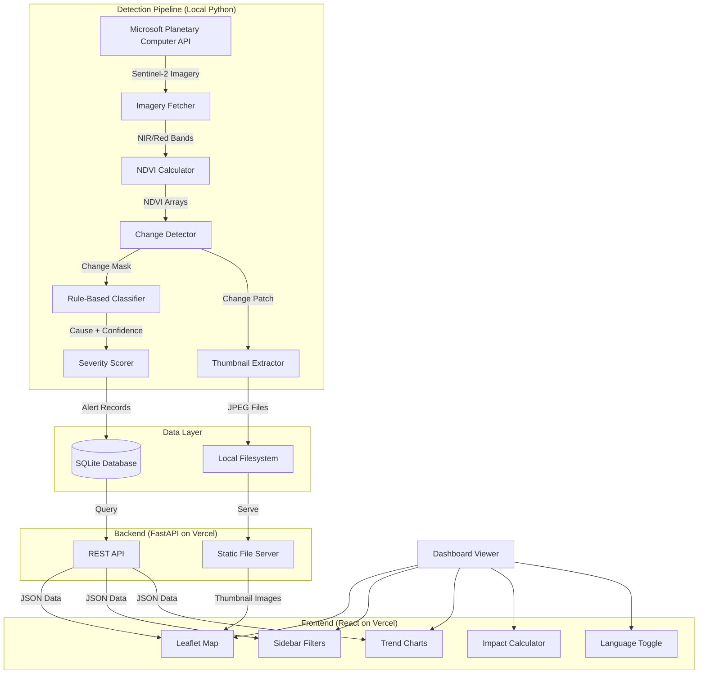
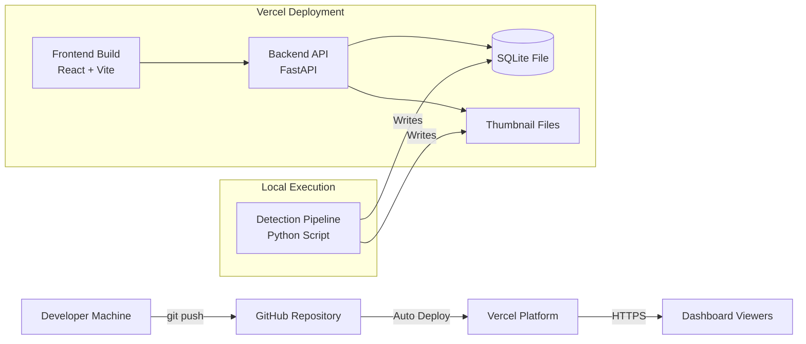

# Design Document — MataBumi Deforestation Monitoring System

## Overview

### System Purpose

MataBumi is a full-stack web application that provides national forest transparency for Indonesia through AI-powered deforestation detection and visualization. The system processes satellite imagery to identify vegetation loss, classifies causes using rule-based pattern analysis, and presents results through an interactive web dashboard with switchable map layers.

### Design Goals

1. **Accessibility**: Free-tier hosting with no cloud subscription requirements
2. **Simplicity**: Rule-based classification without ML training data requirements
3. **Completeness**: Full coverage of Indonesia's 38 provinces
4. **Interactivity**: Rich web dashboard with map layer switching and bilingual support
5. **Portability**: Local SQLite database with file-based storage

### Key Design Decisions

**Local-First Architecture**: The system uses SQLite for data storage and local filesystem for thumbnails, eliminating cloud database dependencies and enabling easy deployment to Vercel's free tier.

**Rule-Based Classification**: Instead of requiring labeled training data and ML model training, the system uses shape analysis (fragmentation, compactness) and geographic heuristics to classify deforestation causes with 60-85% confidence.

**Parallel Processing**: Province processing uses ThreadPoolExecutor with 4 concurrent workers to balance speed and resource usage, reducing total pipeline execution time.

**Dual Resolution Strategy**: The system defaults to 60m resolution for speed, with automatic fallback to 120m on memory errors, ensuring robustness across different deployment environments.

**Static Thumbnail Serving**: Satellite thumbnails are stored as local JPEG files and served via FastAPI static file endpoint, avoiding blob storage costs and complexity.

## Architecture

### System Architecture Diagram



### Component Layers

**Layer 1: Data Acquisition**
- Microsoft Planetary Computer API client
- Sentinel-2 imagery fetcher with cloud cover filtering
- Automatic resolution fallback (60m → 120m)

**Layer 2: Detection Pipeline**
- NDVI calculator (NIR-Red formula)
- Change detector (before/after comparison)
- Rule-based cause classifier (shape metrics + geographic heuristics)
- Severity scorer (area + cause + protected zone)
- Thumbnail extractor (256x256 RGB patches)

**Layer 3: Data Storage**
- SQLite database (matabumi.db)
- Local filesystem (outputs/thumbnails/)
- Hero image generator (before/after/change visualizations)

**Layer 4: Backend API**
- FastAPI REST endpoints
- SQLite query layer
- Static file serving for thumbnails
- CORS configuration for frontend

**Layer 5: Frontend Dashboard**
- React + Vite build system
- Leaflet.js interactive map with layer control
- Chart.js trend visualizations
- Tailwind CSS styling
- Bilingual support (EN/ID)

### Deployment Architecture



**Deployment Strategy**:
1. Detection pipeline runs locally on developer machine
2. Pipeline writes to SQLite database and thumbnail directory
3. Database and thumbnails are committed to Git repository
4. Vercel auto-deploys frontend and backend on push to main
5. Backend serves data from committed SQLite file
6. Frontend fetches data via API and displays on map

## Components and Interfaces

### Detection Pipeline Components

#### 1. Imagery Fetcher (`detection/fetch_imagery.py`)

**Purpose**: Fetch Sentinel-2 satellite imagery from Microsoft Planetary Computer

**Interface**:
```python
def get_catalog() -> pystac_client.Client:
    """
    Returns STAC catalog client with SAS token signing.
    Works with or without API key - unauthenticated access supported.
    If PLANETARY_COMPUTER_API_KEY is set, uses it for reduced rate limiting.
    """

def fetch_imagery(
    catalog: pystac_client.Client,
    bbox: List[float],  # [minx, miny, maxx, maxy]
    date_range: str,    # "YYYY-MM-DD/YYYY-MM-DD"
    resolution: int = 60
) -> Tuple[Optional[np.ndarray], Optional[np.ndarray]]:
    """
    Returns (NIR, Red) band arrays or (None, None) if no imagery found.
    Automatically selects clearest image (lowest cloud cover).
    """
```

**Dependencies**:
- `planetary-computer`: SAS token signing (works without API key)
- `pystac-client`: STAC catalog search
- `stackstac`: Raster stack creation
- Environment: `CLOUD_COVER_MAX` (required), `PLANETARY_COMPUTER_API_KEY` (optional)

**Error Handling**:
- Returns `(None, None)` if no items found
- Retries with 25% cloud cover if primary threshold fails
- Catches MemoryError and retries at 120m resolution

#### 2. NDVI Calculator (`detection/ndvi.py`)

**Purpose**: Calculate Normalized Difference Vegetation Index from satellite bands

**Interface**:
```python
def calculate_ndvi(nir: np.ndarray, red: np.ndarray) -> np.ndarray:
    """
    Computes NDVI = (NIR - Red) / (NIR + Red + epsilon)
    Returns array with values between -1.0 and 1.0
    """

def detect_change(
    ndvi_before: np.ndarray,
    ndvi_after: np.ndarray
) -> Tuple[np.ndarray, np.ndarray]:
    """
    Returns (change_map, deforestation_mask)
    change_map: NDVI decrease values
    deforestation_mask: Boolean array where change > threshold
    """

def estimate_area(mask: np.ndarray, resolution_m: int = 60) -> float:
    """
    Returns deforestation area in hectares
    """

def save_hero_image(
    ndvi_before: np.ndarray,
    ndvi_after: np.ndarray,
    change: np.ndarray,
    province: str,
    output_dir: str = "outputs"
) -> str:
    """
    Generates before/after/change visualization
    Returns path to saved PNG file
    """
```

**Dependencies**:
- `numpy`: Array operations
- `matplotlib`: Visualization
- Environment: `NDVI_CHANGE_THRESHOLD`

**Constants**:
- `EPSILON = 1e-10`: Prevents division by zero
- `THRESHOLD = 0.2`: Minimum NDVI change for deforestation
- `MIN_AREA_HA = 50`: Minimum area to record alert

#### 3. Rule-Based Classifier (`detection/classify.py`)

**Purpose**: Classify deforestation cause using shape analysis and geographic heuristics

**Interface**:
```python
def classify_cause(
    ndvi_change_patch: np.ndarray,
    province: str,
    bbox: List[float]
) -> Tuple[str, float]:
    """
    Returns (cause_label, confidence_score)
    cause_label: "logging" | "plantation" | "mining" | "fire" | "unknown"
    confidence_score: 0.60 to 0.85
    """
```

**Classification Algorithm**:

1. **Shape Metrics Extraction**:
   - Fragmentation index = num_patches / total_area
   - Compactness = perimeter² / (4π × area)
   - Mean intensity = average NDVI change in deforested pixels

2. **Decision Rules**:
   ```
   IF compactness < 1.5 AND fragmentation < 0.1:
       → Plantation (geometric clearing)
   ELSE IF mean_change > 0.4 AND compactness < 2.0:
       → Mining (high intensity, circular)
   ELSE IF fragmentation > 0.15 AND compactness > 2.5:
       → Logging (irregular, fragmented)
   ELSE IF num_patches < 3 AND area > 1000 pixels:
       → Fire (large contiguous)
   ELSE:
       → Logging (default for Indonesia)
   ```

3. **Geographic Heuristics**:
   - Mining provinces: Kalimantan Timur, Papua, Maluku (+0.10 confidence)
   - Plantation provinces: Riau, Sumatera Selatan, Kalimantan Tengah (+0.10 confidence)

**Dependencies**:
- `scipy.ndimage`: Connected component labeling
- `numpy`: Array operations

#### 4. Severity Scorer (`detection/severity.py`)

**Purpose**: Calculate severity score and label for deforestation events

**Interface**:
```python
def calculate_severity(
    area_ha: float,
    cause: str,
    province: str
) -> Tuple[str, bool]:
    """
    Returns (severity_label, is_protected_zone)
    severity_label: "low" | "moderate" | "high" | "critical"
    is_protected_zone: True if province is protected
    """
```

**Scoring Formula**:
```
score = (area_score × 0.4) + (cause_weight × 100 × 0.4) + (protected_bonus)

area_score:
  < 100 ha: 20
  100-499 ha: 40
  500-1999 ha: 70
  ≥ 2000 ha: 90

cause_weight:
  logging: 1.0
  mining: 0.9
  plantation: 0.7
  fire: 0.5
  unknown: 0.6

protected_bonus: +20 if in protected province

severity_label:
  score ≥ 80 OR protected: "critical"
  score ≥ 60: "high"
  score ≥ 35: "moderate"
  score < 35: "low"
```

**Protected Provinces**: Papua, Papua Barat, Kalimantan Timur

#### 5. Thumbnail Extractor (`detection/thumbnails.py`)

**Purpose**: Extract and save satellite image patches for web display

**Interface**:
```python
def extract_thumbnail(
    nir: np.ndarray,
    red: np.ndarray,
    green: np.ndarray,
    change_mask: np.ndarray,
    province: str,
    date: str,
    event_id: int,
    output_dir: str = "outputs/thumbnails"
) -> Optional[str]:
    """
    Extracts 256x256 pixel patch centered on deforestation
    Converts to RGB false-color composite (NIR-Red-Green)
    Saves as JPEG with quality=85
    Returns relative file path or None on error
    """
```

**Processing Steps**:
1. Find centroid of change mask
2. Extract 256x256 window centered on centroid
3. Normalize bands to 0-255 range
4. Stack as RGB (NIR→R, Red→G, Green→B)
5. Save as JPEG: `{province}_{date}_{event_id}.jpg`

#### 6. Pipeline Orchestrator (`pipeline/run.py`)

**Purpose**: Coordinate all detection steps for all provinces

**Interface**:
```python
def get_date_ranges() -> Tuple[str, str]:
    """
    Returns (before_range, after_range)
    before_range: 60-90 days prior
    after_range: 0-30 days prior
    """

def run_pipeline(provinces: Optional[List[str]] = None) -> None:
    """
    Executes detection pipeline for specified provinces
    If provinces=None, processes all 38 provinces
    Uses ThreadPoolExecutor with max_workers=4
    """
```

**Execution Flow**:
```
FOR EACH province IN parallel (4 workers):
    1. Fetch before imagery (60-90 days ago)
    2. Fetch after imagery (0-30 days ago)
    3. Calculate NDVI for both periods
    4. Detect change and estimate area
    5. IF area < 50 ha: skip
    6. Classify cause (center crop patch)
    7. Calculate severity score
    8. Extract thumbnail
    9. Insert alert record to SQLite
    10. Generate hero image
    11. Log result
```

### Backend API Components

#### 1. FastAPI Application (`backend/api/main.py`)

**Purpose**: REST API server for frontend data access

**Configuration**:
```python
app = FastAPI(
    title="MataBumi API",
    version="1.0.0",
    description="Deforestation monitoring API for Indonesia"
)

# CORS configuration
app.add_middleware(
    CORSMiddleware,
    allow_origins=[
        "http://localhost:5173",  # Vite dev server
        "https://matabumi.vercel.app"  # Production
    ],
    allow_methods=["GET"],
    allow_headers=["*"]
)

# Static file serving for thumbnails
app.mount(
    "/api/thumbnails",
    StaticFiles(directory="outputs/thumbnails"),
    name="thumbnails"
)
```

#### 2. API Endpoints (`backend/api/routes.py`)

**GET /api/alerts**
```python
@app.get("/api/alerts")
def get_alerts(
    province: Optional[str] = None,
    severity: Optional[str] = None,
    cause: Optional[str] = None,
    start_date: Optional[str] = None,
    end_date: Optional[str] = None,
    limit: int = 100
) -> List[AlertResponse]:
    """
    Returns filtered list of deforestation alerts
    Supports filtering by province, severity, cause, date range
    """
```

**GET /api/provinces**
```python
@app.get("/api/provinces")
def get_provinces() -> List[ProvinceStats]:
    """
    Returns aggregated statistics per province:
    - province name
    - total area lost (hectares)
    - event count
    - dominant cause
    - critical event count
    """
```

**GET /api/stats**
```python
@app.get("/api/stats")
def get_stats() -> StatsResponse:
    """
    Returns national-level statistics:
    - total hectares lost
    - total events
    - breakdown by severity
    - breakdown by cause
    - protected zone breaches
    """
```

**GET /api/trends**
```python
@app.get("/api/trends")
def get_trends(
    province: Optional[str] = None
) -> List[TrendPoint]:
    """
    Returns time-series data for trend charts
    Groups alerts by month
    Returns monthly totals for area and event count
    """
```

**GET /api/forecast**
```python
@app.get("/api/forecast")
def get_forecast(
    province: Optional[str] = None
) -> List[ForecastPoint]:
    """
    Returns predicted deforestation for next period
    Based on historical trend analysis
    """
```

**GET /api/thumbnails/{filename}**
```python
# Served automatically by StaticFiles mount
# Returns JPEG image from outputs/thumbnails/
```

#### 3. Database Layer (`backend/database/db.py`)

**Purpose**: SQLite connection and query functions

**Interface**:
```python
def get_connection() -> sqlite3.Connection:
    """Returns SQLite connection with row factory"""

def insert_alert(alert: dict) -> int:
    """Inserts alert record, returns generated ID"""

def query_alerts(filters: dict) -> List[dict]:
    """Returns filtered alert records"""

def query_province_stats() -> List[dict]:
    """Returns aggregated province statistics"""

def query_national_stats() -> dict:
    """Returns national-level statistics"""

def query_trends(province: Optional[str]) -> List[dict]:
    """Returns monthly time-series data"""
```

### Frontend Components

#### 1. Map Component (`frontend/src/components/Map.jsx`)

**Purpose**: Interactive Leaflet map with layer switching

**Features**:
- **Base Layers** (radio selection):
  - Satellite (Esri World Imagery)
  - Street (OpenStreetMap)
  - Terrain (OpenTopoMap)
  - Dark Mode (CartoDB Dark Matter)

- **Overlay Layers** (checkbox toggles):
  - Province Boundaries (GeoJSON)
  - Deforestation Heatmap (intensity-based)
  - Protected Areas (highlighted provinces)
  - Event Markers (color-coded by severity)

**Props**:
```typescript
interface MapProps {
  alerts: Alert[];
  selectedProvince: string | null;
  onMarkerClick: (alert: Alert) => void;
}
```

**State**:
```typescript
const [baseLayer, setBaseLayer] = useState<'satellite' | 'street' | 'terrain' | 'dark'>('satellite');
const [overlays, setOverlays] = useState({
  provinces: true,
  heatmap: false,
  protected: true,
  markers: true
});
```

#### 2. Sidebar Component (`frontend/src/components/Sidebar.jsx`)

**Purpose**: Filters and statistics panel

**Sections**:
1. **Summary Stats**:
   - Total hectares lost
   - Total events
   - Critical events
   - Protected zone breaches

2. **Filters**:
   - Province dropdown (38 options)
   - Severity checkboxes (low/moderate/high/critical)
   - Cause checkboxes (logging/plantation/mining/fire/unknown)
   - Date range picker

3. **Province List**:
   - Scrollable list of provinces with event counts
   - Click to zoom map to province

**Props**:
```typescript
interface SidebarProps {
  stats: NationalStats;
  filters: FilterState;
  onFilterChange: (filters: FilterState) => void;
  onProvinceSelect: (province: string) => void;
}
```

#### 3. Event Card Component (`frontend/src/components/EventCard.jsx`)

**Purpose**: Display detailed information for selected deforestation event

**Content**:
- Satellite thumbnail image
- Province name
- Detection date
- Area (hectares)
- Cause with confidence percentage
- Severity badge (color-coded)
- Coordinates (lat, lng)
- NDVI values (before/after/change)

**Props**:
```typescript
interface EventCardProps {
  alert: Alert;
  onClose: () => void;
}
```

#### 4. Trend Chart Component (`frontend/src/components/TrendChart.jsx`)

**Purpose**: Visualize deforestation trends over time using Chart.js

**Chart Types**:
1. **Line Chart**: Monthly area lost over time
2. **Bar Chart**: Events by cause category
3. **Stacked Area**: Cumulative loss by province

**Props**:
```typescript
interface TrendChartProps {
  data: TrendPoint[];
  type: 'line' | 'bar' | 'stacked';
}
```

#### 5. Impact Calculator Component (`frontend/src/components/ImpactCalculator.jsx`)

**Purpose**: Interactive widget showing environmental impact of deforestation reduction

**Calculations**:
```typescript
const hectaresSaved = totalArea * (reductionPercent / 100);
const co2Avoided = hectaresSaved * 150 * 3.67; // tonnes
const economicValue = co2Avoided * 15; // USD at $15/tonne
const footballFields = hectaresSaved / 0.714; // 1 ha = 1.4 fields
```

**UI Elements**:
- Slider (0-100% reduction)
- Real-time calculation display
- Visual indicators (tree icons, CO₂ symbol, money icon)
- Comparison text in both languages

#### 6. Language Toggle Component (`frontend/src/components/LanguageToggle.jsx`)

**Purpose**: Switch between English and Indonesian

**Implementation**:
```typescript
const translations = {
  en: {
    title: "MataBumi - Forest Monitoring",
    totalLost: "Total Forest Lost",
    // ... all UI strings
  },
  id: {
    title: "MataBumi - Pemantauan Hutan",
    totalLost: "Total Hutan Hilang",
    // ... all UI strings
  }
};

const [language, setLanguage] = useState<'en' | 'id'>('id');
```

## Data Models

### Database Schema

#### Table: `deforestation_alerts`

```sql
CREATE TABLE deforestation_alerts (
    id INTEGER PRIMARY KEY AUTOINCREMENT,
    detected_at DATE NOT NULL,
    province TEXT NOT NULL,
    lat REAL NOT NULL,
    lng REAL NOT NULL,
    bbox_minx REAL,
    bbox_miny REAL,
    bbox_maxx REAL,
    bbox_maxy REAL,
    area_ha REAL NOT NULL,
    cause TEXT,  -- logging, plantation, mining, fire, unknown
    confidence REAL,  -- 0.0 to 1.0
    severity TEXT,  -- low, moderate, high, critical
    is_protected_zone INTEGER DEFAULT 0,  -- 0 or 1
    ndvi_before REAL,
    ndvi_after REAL,
    ndvi_change REAL,
    thumbnail_path TEXT,  -- relative path to JPEG file
    created_at DATETIME DEFAULT CURRENT_TIMESTAMP
);

CREATE INDEX idx_province ON deforestation_alerts(province);
CREATE INDEX idx_detected_at ON deforestation_alerts(detected_at);
CREATE INDEX idx_severity ON deforestation_alerts(severity);
```

#### Table: `deforestation_forecasts`

```sql
CREATE TABLE deforestation_forecasts (
    id INTEGER PRIMARY KEY AUTOINCREMENT,
    province TEXT NOT NULL,
    forecast_date DATE NOT NULL,
    predicted_area_ha REAL NOT NULL,
    confidence_interval_lower REAL,
    confidence_interval_upper REAL,
    created_at DATETIME DEFAULT CURRENT_TIMESTAMP
);

CREATE INDEX idx_forecast_province ON deforestation_forecasts(province);
CREATE INDEX idx_forecast_date ON deforestation_forecasts(forecast_date);
```

### API Response Models

#### AlertResponse
```typescript
interface AlertResponse {
  id: number;
  detected_at: string;  // ISO date
  province: string;
  lat: number;
  lng: number;
  bbox: [number, number, number, number];  // [minx, miny, maxx, maxy]
  area_ha: number;
  cause: "logging" | "plantation" | "mining" | "fire" | "unknown";
  confidence: number;  // 0.0 to 1.0
  severity: "low" | "moderate" | "high" | "critical";
  is_protected_zone: boolean;
  ndvi_before: number;
  ndvi_after: number;
  ndvi_change: number;
  thumbnail_url: string;  // /api/thumbnails/{filename}
  created_at: string;  // ISO datetime
}
```

#### ProvinceStats
```typescript
interface ProvinceStats {
  province: string;
  total_area_ha: number;
  event_count: number;
  dominant_cause: string;
  critical_count: number;
  latest_detection: string;  // ISO date
}
```

#### NationalStats
```typescript
interface NationalStats {
  total_area_ha: number;
  total_events: number;
  by_severity: {
    low: number;
    moderate: number;
    high: number;
    critical: number;
  };
  by_cause: {
    logging: number;
    plantation: number;
    mining: number;
    fire: number;
    unknown: number;
  };
  protected_zone_breaches: number;
  latest_update: string;  // ISO datetime
}
```

#### TrendPoint
```typescript
interface TrendPoint {
  month: string;  // YYYY-MM
  area_ha: number;
  event_count: number;
  province?: string;  // if filtered by province
}
```

#### ForecastPoint
```typescript
interface ForecastPoint {
  forecast_date: string;  // ISO date
  predicted_area_ha: number;
  confidence_interval_lower: number;
  confidence_interval_upper: number;
  province?: string;  // if filtered by province
}
```

### Configuration Data

#### Province Bounding Boxes
```python
PROVINCE_BBOXES: Dict[str, List[float]] = {
    # Format: [minx, miny, maxx, maxy] in WGS84
    "Aceh": [95.0, 2.0, 98.5, 6.0],
    "Sumatera Utara": [97.5, 1.0, 100.5, 4.5],
    # ... 36 more provinces
}
```

#### Protected Provinces
```python
PROTECTED_PROVINCES: List[str] = [
    "Papua",
    "Papua Barat",
    "Kalimantan Timur"
]
```

#### Cause Weights
```python
CAUSE_WEIGHTS: Dict[str, float] = {
    "logging": 1.0,
    "mining": 0.9,
    "plantation": 0.7,
    "fire": 0.5,
    "unknown": 0.6
}
```

#### Environment Variables

**Required Environment Variables**:
- `CLOUD_COVER_MAX`: Maximum cloud cover percentage (default: 15)
- `NDVI_CHANGE_THRESHOLD`: Minimum NDVI change for deforestation (default: 0.2)
- `CONFIDENCE_THRESHOLD`: Minimum confidence to store alert (default: 0.6)
- `MINIMUM_ALERT_AREA`: Minimum area in hectares (default: 50)
- `DATABASE_PATH`: Path to SQLite database file
- `OUTPUT_DIR`: Directory for hero images
- `THUMBNAIL_DIR`: Directory for satellite thumbnails

**Optional Environment Variables**:
- `PLANETARY_COMPUTER_API_KEY`: Microsoft Planetary Computer API key
  - **Status**: Optional (not required)
  - **Purpose**: Reduces rate limiting on SAS token generation
  - **Without key**: Unauthenticated access works but has more rate limiting
  - **Recommendation**: For research/experimentation, unauthenticated access is sufficient
  - **For heavy usage**: Consider Planetary Computer Pro (paid subscription)
  - **Historical note**: Free API key system was retired on June 6, 2024 with the Planetary Computer Hub
  - **Implementation**: Use `planetary_computer.sign_inplace` modifier without authentication

**Code Example (No API Key Required)**:
```python
import planetary_computer
import pystac_client

# Works without API key - unauthenticated access
catalog = pystac_client.Client.open(
    "https://planetarycomputer.microsoft.com/api/stac/v1",
    modifier=planetary_computer.sign_inplace,  # Signs SAS tokens without key
)
```


## Correctness Properties

*A property is a characteristic or behavior that should hold true across all valid executions of a system—essentially, a formal statement about what the system should do. Properties serve as the bridge between human-readable specifications and machine-verifiable correctness guarantees.*

The MataBumi system includes several pure mathematical functions that are well-suited for property-based testing. These functions (NDVI calculation, change detection, severity scoring, classification) have universal properties that should hold across all valid inputs. Property-based testing will verify these invariants by generating hundreds of random test cases.

### Property 1: NDVI Values Are Always Bounded

*For any* positive NIR and Red band arrays of matching dimensions, the calculated NDVI values SHALL always be between -1.0 and 1.0 inclusive, and the function SHALL never raise exceptions.

**Validates: Requirements 2.2, 2.3**

**Rationale**: The NDVI formula (NIR - Red) / (NIR + Red + ε) mathematically guarantees bounded output for positive inputs. This property verifies both the mathematical correctness and robustness of the implementation.

### Property 2: NDVI Preserves Array Shape

*For any* NIR and Red arrays with matching spatial dimensions, the output NDVI array SHALL have exactly the same shape as the input arrays.

**Validates: Requirements 2.8**

**Rationale**: NDVI is a pixel-wise operation that should preserve spatial structure. This property ensures no dimension errors occur during calculation.

### Property 3: Change Detection Formula Correctness

*For any* NDVI_before and NDVI_after arrays of matching dimensions, the change array SHALL equal (NDVI_before - NDVI_after) at every pixel location.

**Validates: Requirements 3.1**

**Rationale**: Change detection is a simple subtraction operation. This property verifies the formula is applied correctly across all array elements.

### Property 4: Deforestation Area Is Non-Negative

*For any* deforestation mask and resolution value, the calculated area in hectares SHALL always be greater than or equal to 0.0.

**Validates: Requirements 3.6**

**Rationale**: Area is a physical quantity that cannot be negative. This property catches implementation errors in area calculation.

### Property 5: Classifier Returns Valid Outputs

*For any* NDVI change patch, province name, and bounding box, the classifier SHALL return a cause label from the set {logging, plantation, mining, fire, unknown} and a confidence score between 0.60 and 0.85 inclusive.

**Validates: Requirements 5.8, 5.9**

**Rationale**: The rule-based classifier must always produce valid outputs. This property verifies output types and ranges are correct for all inputs.

### Property 6: Severity Score Is Bounded

*For any* area value, cause label, and province name, the severity score SHALL be between 0 and 100 inclusive.

**Validates: Requirements 6.1**

**Rationale**: The severity scoring formula combines weighted factors. This property ensures the calculation never produces out-of-range scores.

### Property 7: Severity Labels Match Score Thresholds

*For any* calculated severity score, the assigned severity label SHALL be:
- "low" when score < 35
- "moderate" when 35 ≤ score < 60
- "high" when 60 ≤ score < 80
- "critical" when score ≥ 80

**Validates: Requirements 6.2, 6.3, 6.4, 6.5**

**Rationale**: Severity labels are determined by fixed thresholds. This property verifies the threshold logic is implemented correctly.

### Property 8: Protected Provinces Always Critical

*For any* area and cause values, when the province is in the set {Papua, Papua Barat, Kalimantan Timur}, the severity label SHALL be "critical" and is_protected_zone SHALL be True.

**Validates: Requirements 6.6**

**Rationale**: Protected provinces require automatic escalation to critical severity regardless of calculated score. This property ensures the override rule is applied correctly.

### Property 9: NDVI Calculation Handles Zero Inputs

*For any* arrays where NIR and Red are both zero at some pixels, the NDVI calculation SHALL not raise division by zero errors and SHALL return finite values.

**Validates: Requirements 2.4**

**Rationale**: The epsilon term (1e-10) prevents division by zero. This property verifies the safeguard works correctly.

### Property 10: Area Calculation Scales With Resolution

*For any* deforestation mask, when resolution is doubled, the calculated area SHALL be multiplied by 4 (since area scales with resolution²).

**Validates: Requirements 3.5**

**Rationale**: Area calculation depends on pixel size. This property verifies the resolution scaling is implemented correctly.

## Error Handling

### External API Failures

**Planetary Computer API**:
- **Timeout**: Retry with exponential backoff (1s, 2s, 4s)
- **No imagery found**: Log warning and skip province
- **Cloud cover too high**: Retry with 25% threshold, then skip
- **Rate limiting**: API key is optional; unauthenticated access has more rate limiting on SAS token generation but is sufficient for research/experimentation

**Error Response**:
```python
try:
    nir, red = fetch_imagery(catalog, bbox, date_range)
except requests.Timeout:
    logger.warning(f"Timeout fetching imagery for {province}")
    return None
except Exception as e:
    logger.error(f"Unexpected error for {province}: {e}")
    return None
```

### Memory Errors

**Large Province Processing**:
- **MemoryError on 60m resolution**: Automatically retry at 120m
- **MemoryError on 120m resolution**: Log error and skip province
- **Log resolution used**: Track which provinces required fallback

**Implementation**:
```python
try:
    nir, red = fetch_imagery(catalog, bbox, date_range, resolution=60)
except MemoryError:
    logger.warning(f"Memory error at 60m for {province}, retrying at 120m")
    nir, red = fetch_imagery(catalog, bbox, date_range, resolution=120)
```

### Data Quality Issues

**Missing Bands**:
- **Band 8 or Band 4 missing**: Skip item and try next in search results
- **All items missing bands**: Log error and skip province

**NaN Values**:
- **NaN in NDVI arrays**: Propagate NaN without crashing
- **NaN in change detection**: Mask out NaN pixels before area calculation
- **NaN in classification**: Use nanmean for intensity calculation

**Invalid Coordinates**:
- **Bounding box outside Indonesia**: Raise ValueError immediately
- **Lat/lng out of range**: Validate before database insertion

### Database Errors

**SQLite Connection**:
- **Database locked**: Retry up to 3 times with 1s delay
- **Disk full**: Raise error immediately (critical failure)
- **Schema mismatch**: Raise error immediately (deployment issue)

**Insert Failures**:
- **Constraint violation**: Log error and continue to next province
- **NULL in required field**: Validate before insertion

**Implementation**:
```python
def insert_alert(alert: dict, max_retries: int = 3) -> Optional[int]:
    for attempt in range(max_retries):
        try:
            conn = get_connection()
            cursor = conn.cursor()
            cursor.execute(INSERT_SQL, alert_values)
            conn.commit()
            return cursor.lastrowid
        except sqlite3.OperationalError as e:
            if "locked" in str(e) and attempt < max_retries - 1:
                time.sleep(1)
                continue
            logger.error(f"Database error: {e}")
            return None
        finally:
            conn.close()
```

### File I/O Errors

**Thumbnail Extraction**:
- **Write permission denied**: Log error, set thumbnail_path to NULL
- **Disk full**: Log error, set thumbnail_path to NULL
- **Invalid image data**: Log error, set thumbnail_path to NULL

**Hero Image Generation**:
- **Matplotlib rendering error**: Log error and continue (non-critical)
- **Directory creation failure**: Raise error (deployment issue)

**Graceful Degradation**:
```python
try:
    thumbnail_path = extract_thumbnail(nir, red, green, mask, province, date, event_id)
except Exception as e:
    logger.error(f"Thumbnail extraction failed for {province}: {e}")
    thumbnail_path = None  # Continue without thumbnail
```

### Pipeline Orchestration Errors

**Province Processing Failure**:
- **Any step fails**: Log error with province name and step
- **Continue to next province**: Never crash entire pipeline
- **Collect failure statistics**: Report at end of pipeline run

**Parallel Execution**:
- **Thread exception**: Catch in worker thread, log, and continue
- **Timeout**: Set per-province timeout of 10 minutes
- **Resource exhaustion**: Limit to 4 concurrent workers

**Implementation**:
```python
def process_province(province: str) -> Optional[dict]:
    try:
        # All detection steps
        return alert_data
    except Exception as e:
        logger.error(f"Failed to process {province}: {e}")
        return None

with ThreadPoolExecutor(max_workers=4) as executor:
    futures = {executor.submit(process_province, p): p for p in provinces}
    for future in as_completed(futures):
        result = future.result()  # Exceptions already caught
        if result:
            results.append(result)
```

### Frontend Error Handling

**API Request Failures**:
- **Network timeout**: Show "Loading..." spinner, retry after 5s
- **500 Internal Server Error**: Show error message, allow retry
- **404 Not Found**: Show "No data available" message

**Map Rendering Errors**:
- **Invalid GeoJSON**: Log error, skip layer
- **Tile loading failure**: Show error tile, continue with other layers
- **Marker rendering error**: Skip marker, continue with others

**User Input Validation**:
- **Invalid date range**: Show validation error, prevent submission
- **Invalid filter combination**: Show warning, allow submission
- **Empty results**: Show "No events match your filters" message

## Testing Strategy

### Unit Testing

**Core Mathematical Functions** (pytest):
- NDVI calculation with known inputs
- Change detection with synthetic arrays
- Area estimation with various mask sizes
- Severity scoring with edge cases
- Classifier decision rules with crafted patches

**Example Tests**:
```python
def test_ndvi_known_values():
    """Test NDVI with known NIR and Red values"""
    nir = np.array([[100, 200], [150, 250]])
    red = np.array([[50, 100], [75, 125]])
    ndvi = calculate_ndvi(nir, red)
    expected = np.array([[0.333, 0.333], [0.333, 0.333]])
    np.testing.assert_array_almost_equal(ndvi, expected, decimal=3)

def test_severity_protected_province():
    """Test that protected provinces always return critical"""
    severity, is_protected = calculate_severity(100, "logging", "Papua")
    assert severity == "critical"
    assert is_protected == True
```

### Property-Based Testing

**Library**: `hypothesis` for Python

**Configuration**: Minimum 100 iterations per property test

**Test Implementation**:
```python
from hypothesis import given, strategies as st
import numpy as np

@given(
    nir=st.lists(st.floats(min_value=0, max_value=10000), min_size=100, max_size=1000),
    red=st.lists(st.floats(min_value=0, max_value=10000), min_size=100, max_size=1000)
)
def test_property_ndvi_bounded(nir, red):
    """
    Feature: matabumi-deforestation-pipeline, Property 1:
    NDVI values are always bounded between -1.0 and 1.0
    """
    nir_array = np.array(nir)
    red_array = np.array(red)
    ndvi = calculate_ndvi(nir_array, red_array)
    
    assert np.all(ndvi >= -1.0), "NDVI values below -1.0 found"
    assert np.all(ndvi <= 1.0), "NDVI values above 1.0 found"
    assert np.all(np.isfinite(ndvi)), "Non-finite NDVI values found"

@given(
    area=st.floats(min_value=0, max_value=100000),
    cause=st.sampled_from(["logging", "plantation", "mining", "fire", "unknown"]),
    province=st.sampled_from(["Aceh", "Papua", "Jawa Barat"])
)
def test_property_severity_bounded(area, cause, province):
    """
    Feature: matabumi-deforestation-pipeline, Property 6:
    Severity score is always between 0 and 100
    """
    severity_label, is_protected = calculate_severity(area, cause, province)
    
    # Calculate score to verify bounds
    score = calculate_severity_score(area, cause, province)
    assert 0 <= score <= 100, f"Score {score} out of bounds"

@given(
    province=st.sampled_from(["Papua", "Papua Barat", "Kalimantan Timur"]),
    area=st.floats(min_value=50, max_value=10000),
    cause=st.sampled_from(["logging", "plantation", "mining", "fire", "unknown"])
)
def test_property_protected_always_critical(province, area, cause):
    """
    Feature: matabumi-deforestation-pipeline, Property 8:
    Protected provinces always return critical severity
    """
    severity, is_protected = calculate_severity(area, cause, province)
    assert severity == "critical", f"Protected province {province} not critical"
    assert is_protected == True, f"Protected flag not set for {province}"
```

**Property Test Tags**: Each property test includes a comment with the format:
```
Feature: matabumi-deforestation-pipeline, Property {number}: {property_text}
```

### Integration Testing

**Database Operations**:
- Use in-memory SQLite (`:memory:`) for tests
- Test alert insertion with valid data
- Test query filtering with various parameters
- Test concurrent access (multiple threads)

**API Endpoints**:
- Use FastAPI TestClient
- Test each endpoint with valid parameters
- Test filtering and pagination
- Test error responses (404, 500)

**Example**:
```python
from fastapi.testclient import TestClient

def test_get_alerts_filtered_by_province():
    client = TestClient(app)
    response = client.get("/api/alerts?province=Aceh")
    assert response.status_code == 200
    data = response.json()
    assert all(alert["province"] == "Aceh" for alert in data)
```

**Pipeline Orchestration**:
- Mock external API calls (Planetary Computer)
- Test province processing with synthetic data
- Test error handling and recovery
- Test parallel execution

### Frontend Testing

**Component Tests** (React Testing Library):
- Map component renders with alerts
- Sidebar filters update map display
- Event card shows correct details
- Language toggle switches text

**Example**:
```typescript
import { render, screen, fireEvent } from '@testing-library/react';

test('language toggle switches to Indonesian', () => {
  render(<App />);
  const toggle = screen.getByRole('button', { name: /language/i });
  fireEvent.click(toggle);
  expect(screen.getByText('Total Hutan Hilang')).toBeInTheDocument();
});
```

**End-to-End Tests** (Playwright):
- User can filter alerts by province
- User can switch map layers
- User can view event details
- Impact calculator updates on slider change

### Test Coverage Goals

- **Unit tests**: 80% code coverage for core functions
- **Property tests**: 100% coverage of pure mathematical functions
- **Integration tests**: All API endpoints and database operations
- **Frontend tests**: All user-facing components and interactions

### Continuous Integration

**GitHub Actions Workflow**:
```yaml
name: Test MataBumi

on: [push, pull_request]

jobs:
  test:
    runs-on: ubuntu-latest
    steps:
      - uses: actions/checkout@v4
      - uses: actions/setup-python@v5
        with:
          python-version: '3.11'
      - name: Install dependencies
        run: |
          pip install -r requirements.txt
          pip install pytest hypothesis pytest-cov
      - name: Run unit tests
        run: pytest tests/unit --cov=detection --cov=database
      - name: Run property tests
        run: pytest tests/properties -v
      - name: Run integration tests
        run: pytest tests/integration
```

**Test Execution Order**:
1. Unit tests (fast, no external dependencies)
2. Property tests (100+ iterations, may take longer)
3. Integration tests (database, API, mocked external calls)
4. Frontend tests (component and e2e)

