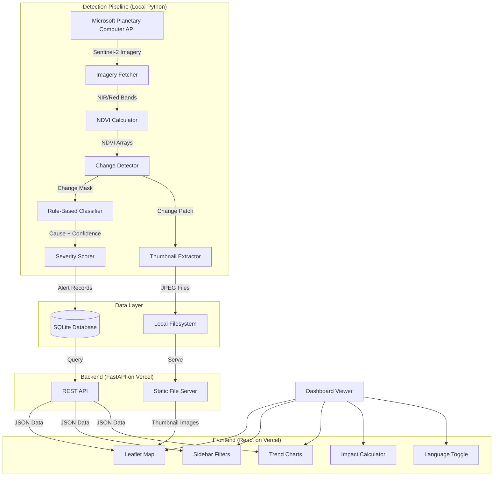
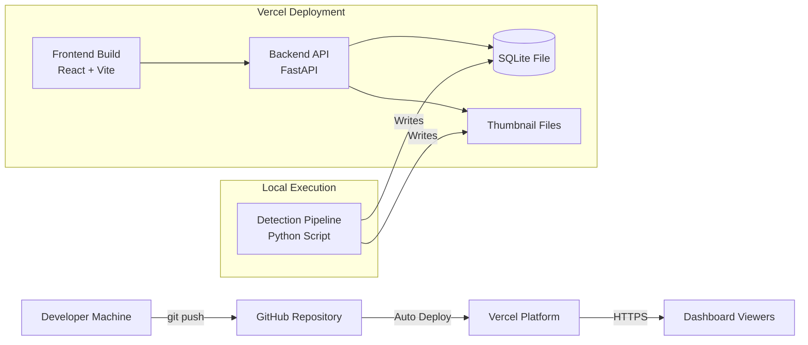

# MataBumi Architecture Document

**Last Updated:** May 14, 2026  
**Spec Location:** `.kiro/specs/matabumi-deforestation-pipeline/`  
**Status:** Design and Requirements Approved, Tasks Generated

This document outlines the technical architecture for the MataBumi deforestation monitoring system based on the approved design specification.

---

## System Overview

MataBumi is a full-stack web application providing national forest transparency for Indonesia through deforestation detection and visualization. The system processes satellite imagery to identify vegetation loss, classifies causes using rule-based pattern analysis, and presents results through an interactive React web dashboard with switchable map layers.

### Key Design Principles

1. **Local-First Architecture**: SQLite database + local filesystem storage (no cloud database dependencies)
2. **Free-Tier Deployment**: Vercel hosting with no subscription requirements
3. **Rule-Based Classification**: Shape analysis + geographic heuristics (no ML training data needed)
4. **Parallel Processing**: ThreadPoolExecutor with 4 workers for faster province processing
5. **Static Asset Serving**: Local JPEG thumbnails served via FastAPI

---

## Architecture Diagram



---

## Component Layers

### Layer 1: Data Acquisition
- **Microsoft Planetary Computer API** client with authentication
- **Sentinel-2 imagery fetcher** with cloud cover filtering (15% primary, 25% fallback)
- **Automatic resolution fallback** (60m → 120m on MemoryError)

### Layer 2: Detection Pipeline
- **NDVI calculator** using (NIR - Red) / (NIR + Red + ε) formula
- **Change detector** comparing before/after NDVI with 0.2 threshold
- **Rule-based classifier** using fragmentation, compactness, intensity metrics
- **Severity scorer** combining area + cause + protected zone status
- **Thumbnail extractor** creating 256x256 RGB patches

### Layer 3: Data Storage
- **SQLite database** (`backend/database/matabumi.db`)
- **Local filesystem** (`outputs/thumbnails/`)
- **Hero image generator** for before/after/change visualizations

### Layer 4: Backend API
- **FastAPI REST endpoints** for alerts, provinces, stats, trends, forecast
- **SQLite query layer** with filtering and aggregation
- **Static file serving** for thumbnails at `/api/thumbnails`
- **CORS configuration** for localhost:5173 and production domain

### Layer 5: Frontend Dashboard
- **React + Vite** build system
- **Leaflet.js** interactive map with 4 base layers + 4 overlay toggles
- **Chart.js** trend visualizations (line, bar, stacked area)
- **Tailwind CSS** styling
- **Bilingual support** (English/Indonesian)

---

## Deployment Architecture



**Deployment Flow:**
1. Detection pipeline runs locally on developer machine
2. Pipeline writes to SQLite database and thumbnail directory
3. Database and thumbnails are committed to Git repository
4. Vercel auto-deploys frontend and backend on push to main
5. Backend serves data from committed SQLite file
6. Frontend fetches data via API and displays on map

---

## Directory Structure

```
matabumi-deforestation-pipeline/
├── detection/
│   ├── __init__.py
│   ├── fetch_imagery.py      # Planetary Computer integration
│   ├── ndvi.py                # NDVI calculation + change detection
│   ├── classify.py            # Rule-based cause classifier
│   ├── severity.py            # Severity scoring
│   └── thumbnails.py          # Thumbnail extraction
│
├── database/
│   ├── __init__.py
│   ├── db.py                  # SQLite operations
│   └── init_db.py             # Schema initialization
│
├── pipeline/
│   ├── __init__.py
│   └── run.py                 # Main orchestration
│
├── backend/
│   ├── api/
│   │   ├── __init__.py
│   │   ├── main.py            # FastAPI app
│   │   └── routes.py          # API endpoints
│   └── database/
│       └── matabumi.db        # SQLite database file
│
├── frontend/
│   ├── src/
│   │   ├── components/
│   │   │   ├── Map.jsx
│   │   │   ├── Sidebar.jsx
│   │   │   ├── EventCard.jsx
│   │   │   ├── TrendChart.jsx
│   │   │   ├── ImpactCalculator.jsx
│   │   │   └── LanguageToggle.jsx
│   │   ├── App.jsx
│   │   └── main.jsx
│   ├── package.json
│   └── vite.config.js
│
├── outputs/
│   ├── thumbnails/            # 256x256 JPEG patches
│   └── matabumi_*.png         # Hero images
│
├── tests/
│   ├── unit/
│   ├── properties/            # Property-based tests
│   └── integration/
│
├── requirements.txt
├── .env.example
├── .gitignore
├── vercel.json
└── README.md
```

---

## Key Technologies

### Backend Stack
- **Python 3.11+** for detection pipeline
- **NumPy** for array operations
- **Matplotlib** for visualizations
- **SciPy** for connected component analysis
- **planetary-computer** for API authentication
- **pystac-client** for STAC catalog search
- **stackstac** for raster stack creation
- **FastAPI** for REST API
- **SQLite3** for database
- **python-dotenv** for environment variables

### Frontend Stack
- **React 18** with TypeScript
- **Vite** for build tooling
- **Leaflet.js** for interactive maps
- **react-leaflet** for React integration
- **Chart.js** for data visualization
- **react-chartjs-2** for React integration
- **Tailwind CSS** for styling
- **Axios** for API requests

### Testing Stack
- **pytest** for unit tests
- **hypothesis** for property-based tests
- **pytest-cov** for coverage reporting
- **React Testing Library** for component tests
- **Playwright** for end-to-end tests

### Deployment
- **Vercel** for hosting (free tier)
- **GitHub Actions** for CI/CD
- **Git** for version control

---

## Database Schema

### Table: `deforestation_alerts`

```sql
CREATE TABLE deforestation_alerts (
    id INTEGER PRIMARY KEY AUTOINCREMENT,
    detected_at DATE NOT NULL,
    province TEXT NOT NULL,
    lat REAL NOT NULL,
    lng REAL NOT NULL,
    bbox_minx REAL,
    bbox_miny REAL,
    bbox_maxx REAL,
    bbox_maxy REAL,
    area_ha REAL NOT NULL,
    cause TEXT,  -- logging, plantation, mining, fire, unknown
    confidence REAL,  -- 0.0 to 1.0
    severity TEXT,  -- low, moderate, high, critical
    is_protected_zone INTEGER DEFAULT 0,  -- 0 or 1
    ndvi_before REAL,
    ndvi_after REAL,
    ndvi_change REAL,
    thumbnail_path TEXT,  -- relative path to JPEG file
    created_at DATETIME DEFAULT CURRENT_TIMESTAMP
);

CREATE INDEX idx_province ON deforestation_alerts(province);
CREATE INDEX idx_detected_at ON deforestation_alerts(detected_at);
CREATE INDEX idx_severity ON deforestation_alerts(severity);
```

---

## API Endpoints

### GET /api/alerts
Returns filtered list of deforestation alerts.

**Query Parameters:**
- `province` (optional): Filter by province name
- `severity` (optional): Filter by severity level
- `cause` (optional): Filter by cause category
- `start_date` (optional): Filter by detection date (ISO format)
- `end_date` (optional): Filter by detection date (ISO format)
- `limit` (optional, default=100): Maximum number of results

**Response:** Array of AlertResponse objects

### GET /api/provinces
Returns aggregated statistics per province.

**Response:** Array of ProvinceStats objects with total area, event count, dominant cause, critical count

### GET /api/stats
Returns national-level statistics.

**Response:** NationalStats object with totals, breakdowns by severity/cause, protected zone breaches

### GET /api/trends
Returns time-series data for trend charts.

**Query Parameters:**
- `province` (optional): Filter by province name

**Response:** Array of TrendPoint objects with monthly area and event counts

### GET /api/forecast
Returns predicted deforestation for next period (placeholder).

**Query Parameters:**
- `province` (optional): Filter by province name

**Response:** Array of ForecastPoint objects

### GET /api/thumbnails/{filename}
Serves static JPEG thumbnail images.

**Response:** JPEG image file

---

## Environment Variables

```env
# Microsoft Planetary Computer
PLANETARY_COMPUTER_API_KEY=your_key_here

# Detection Configuration
NDVI_CHANGE_THRESHOLD=0.2
CLOUD_COVER_MAX=15
MINIMUM_ALERT_AREA=50
CONFIDENCE_THRESHOLD=0.6

# Database
DATABASE_PATH=backend/database/matabumi.db

# Output Directories
OUTPUT_DIR=outputs
THUMBNAIL_DIR=outputs/thumbnails
```

---

## Province Coverage

The system monitors all **38 provinces** of Indonesia:

**Sumatra (10):** Aceh, Sumatera Utara, Sumatera Barat, Riau, Kepulauan Riau, Jambi, Sumatera Selatan, Kepulauan Bangka Belitung, Bengkulu, Lampung

**Java & Bali (7):** Banten, DKI Jakarta, Jawa Barat, Jawa Tengah, DI Yogyakarta, Jawa Timur, Bali

**Nusa Tenggara (2):** Nusa Tenggara Barat, Nusa Tenggara Timur

**Kalimantan (5):** Kalimantan Barat, Kalimantan Tengah, Kalimantan Selatan, Kalimantan Timur, Kalimantan Utara

**Sulawesi (6):** Sulawesi Utara, Gorontalo, Sulawesi Tengah, Sulawesi Barat, Sulawesi Selatan, Sulawesi Tenggara

**Maluku (2):** Maluku, Maluku Utara

**Papua (6):** Papua Barat, Papua Barat Daya, Papua, Papua Selatan, Papua Tengah, Papua Pegunungan

---

## Protected Provinces

Three provinces receive automatic severity escalation to "critical":
- **Papua**
- **Papua Barat**
- **Kalimantan Timur**

---

## Correctness Properties

The system includes 10 property-based tests validating core mathematical functions:

1. **NDVI Values Are Always Bounded** (-1.0 to 1.0)
2. **NDVI Preserves Array Shape**
3. **Change Detection Formula Correctness**
4. **Deforestation Area Is Non-Negative**
5. **Classifier Returns Valid Outputs**
6. **Severity Score Is Bounded** (0 to 100)
7. **Severity Labels Match Score Thresholds**
8. **Protected Provinces Always Critical**
9. **NDVI Calculation Handles Zero Inputs**
10. **Area Calculation Scales With Resolution**

---

## Error Handling Strategy

### External API Failures
- Planetary Computer timeout → Log warning, skip province
- No imagery found → Log warning, skip province
- Cloud cover too high → Retry with 25% threshold, then skip
- Authentication failure → Raise error immediately

### Memory Errors
- MemoryError at 60m → Retry at 120m resolution
- MemoryError at 120m → Log error, skip province

### Data Quality Issues
- Missing bands → Skip item, try next
- NaN values → Propagate without crashing
- Invalid coordinates → Validate before insertion

### Database Errors
- Database locked → Retry up to 3 times with 1s delay
- Disk full → Raise error immediately
- Schema mismatch → Raise error immediately

### Pipeline Orchestration
- Province failure → Log error, continue to next province
- Thread exception → Catch in worker, log, continue
- Never crash entire pipeline due to single province failure

---

## Testing Strategy

### Unit Tests (pytest)
- Core mathematical functions with known inputs
- Edge cases and boundary conditions
- 80% code coverage goal

### Property-Based Tests (hypothesis)
- 100 iterations per property minimum
- All pure mathematical functions
- Validates universal correctness properties

### Integration Tests
- Database operations with in-memory SQLite
- API endpoints with FastAPI TestClient
- Pipeline orchestration with mocked external calls

### Frontend Tests
- Component tests with React Testing Library
- End-to-end tests with Playwright
- All user-facing interactions

---

## Performance Considerations

### Pipeline Execution
- **Parallel processing:** 4 concurrent workers
- **Resolution strategy:** 60m default, 120m fallback
- **Date ranges:** 30-day windows for before/after periods
- **Minimum area threshold:** 50 hectares to reduce noise

### Database Optimization
- **Indexes:** province, detected_at, severity
- **Connection pooling:** Row factory for dict results
- **Retry logic:** 3 attempts with exponential backoff

### Frontend Optimization
- **Lazy loading:** Components loaded on demand
- **Image optimization:** JPEG quality=85 for thumbnails
- **API pagination:** Limit parameter for large result sets
- **Caching:** Browser caching for static assets

---

## Security Considerations

### API Security
- **CORS:** Restricted to localhost:5173 and production domain
- **Read-only endpoints:** No write operations exposed
- **Input validation:** All query parameters validated
- **SQL injection prevention:** Parameterized queries only

### Credential Management
- **Environment variables:** All secrets in .env (never committed)
- **.env.example:** Template without actual credentials
- **.gitignore:** Excludes .env and sensitive files

### Data Privacy
- **No personal data:** Only geographic and environmental data
- **Public information:** All data suitable for public display
- **No authentication required:** Public transparency dashboard

---

## Deployment Checklist

### Pre-Deployment
- [ ] Run full test suite (unit + property + integration)
- [ ] Verify all environment variables set
- [ ] Run pipeline on subset of provinces
- [ ] Verify database populated with alerts
- [ ] Verify thumbnails generated
- [ ] Test API endpoints locally
- [ ] Test frontend locally

### Vercel Configuration
- [ ] Create `vercel.json` configuration
- [ ] Set environment variables in Vercel dashboard
- [ ] Configure FastAPI as serverless function
- [ ] Configure React build output directory
- [ ] Commit database and thumbnails to repository
- [ ] Verify `.gitignore` doesn't exclude required files

### Post-Deployment
- [ ] Verify live site loads
- [ ] Test all API endpoints in production
- [ ] Verify map displays alerts correctly
- [ ] Test all filters and interactions
- [ ] Verify language toggle works
- [ ] Test impact calculator
- [ ] Monitor for errors in Vercel logs

---

## Future Enhancements

### Phase 2: Enhanced Detection
- SAR radar integration for cloud penetration
- Higher resolution imagery (10m bands)
- Real-time alerts via webhooks

### Phase 3: Advanced Analytics
- Time-series forecasting with statistical models
- Deforestation rate comparison
- Cumulative loss tracking

### Phase 4: Integration
- Carbon credit marketplace integration
- NGO alert routing
- Government reporting API

---

**For implementation details, see:**
- Design Document: `.kiro/specs/matabumi-deforestation-pipeline/design.md`
- Requirements Document: `.kiro/specs/matabumi-deforestation-pipeline/requirements.md`
- Implementation Tasks: `.kiro/specs/matabumi-deforestation-pipeline/tasks.md`
